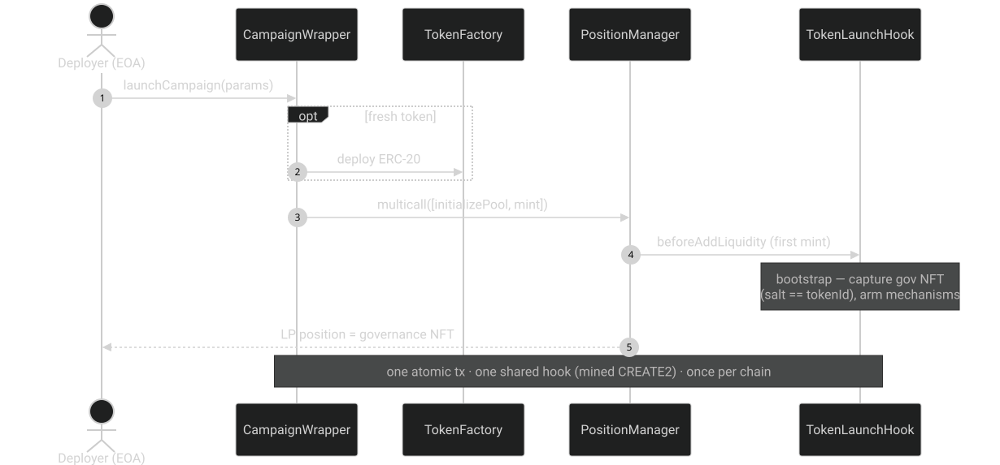

# TokenLaunchHook&nbsp;Studio

## A studio for Uniswap&nbsp;v4 launch hooks

This is one example hook · live on Ethereum · Unichain · Unichain Sepolia

Note:
Hi — this is TokenLaunchHook Studio. Think of it as a studio for launch hooks: the framework is a single shared v4 hook plus pluggable mechanisms, and what you'll see today is *one* hook — a fair-launch hook — built on it as the example. Other hooks and other mechanisms can plug into the same studio. And it does all this as a Uniswap v4 hook, without ever changing the token contract. Let me show you the problem it solves first.

---

## A fix for the pains every campaign hits

Note:
Every launch is a battlefield. Snipers grab the first block and dump on everyone. Sandwich bots tax every early buyer. Teams pull the liquidity. And nobody gets fair access — it's a free-for-all. These are the real pains of running a campaign, and this hook is built to answer each one — directly. The usual alternative is to bake anti-bot logic into the ERC-20 itself, which means more code to audit and a token that's hard to integrate. Our point: every one of these pains happens in the pool, so the fix should live in the pool — not in the token.

---

## The insight — rules in the *pool*, not the token

The ERC-20 stays a plain ERC-20 — bring your own. The hook does the work at the swap, the mint, the exit.

Note:
v4 hooks let you run code on every pool action. So we wrote one hook that enforces the launch rules on swaps, liquidity adds, and removals. The token is untouched — you can even bring your own existing ERC-20.

---

## Four mechanisms, wired to hook callbacks

Tax uses v4's <em>dynamic LP fee</em> — caps at 10%, decays linearly. Anti-snipe window ≤ 1 day. Enable any subset, per launch.

Note:
Four mechanisms, each wired to a specific hook callback. Anti-snipe caps buy size. The tax is a dynamic LP fee — asymmetric buy-versus-sell and it decays to a floor, so it's protective at launch and fades out. Liquidity lock keeps the deployer from rugging, by time and/or by traded volume. And an optional whitelist phase. You pick which ones to enable per launch.

---

## Governance = *own the NFT*

First LP position = the governance NFT (<code>salt == tokenId</code>). No admin key — transfer it to a Safe or DAO.

Note:
Who controls a launch? Whoever holds the governance NFT — and that NFT is just the deployer's own liquidity position. There's no owner address, no admin key. And crucially, every change is a one-way ratchet: you can only make things fairer — lower the tax, shorten the lock — never the reverse. After the launch window, it all freezes.

---

## Architecture — one atomic launch

<strong>TokenLaunchHook</strong> (one shared, mined-CREATE2 hook · per-pool state in <code>mapping(PoolId⇒…)</code>) · <strong>CampaignWrapper</strong> (atomic launch) · <strong>TokenFactory</strong> (optional cloner). Deployed once per chain, non-upgradeable.

Note:
Three contracts, deployed once per chain. A single hook — mined to a CREATE2 address that encodes its permission flags — serves every launch. A launch is one atomic transaction: initialize the pool and mint the seed position in a single multicall, with all the module config passed in hookData. Non-upgradeable: a new version is a new deployment, not a proxy.

---

## Not just a launcher — a live demo of the v4 hook

The studio's job isn't only to *launch* a campaign — it **demonstrates the Uniswap v4 hook mechanisms** as they fire.

- `HookBadge` on every control · `HookExplainer` popovers
- `HookCallTrace` — after a tx, *what the hook actually did*
- `HookActivityPanel` — live on-chain hook state

Every action is labelled with the callback it triggers — see the mechanism, don't just trust it.

Note:
The front end isn't just a launcher — it's a live demo of the hook: every control is badged with the v4 callback it fires, so you can see each mechanism map to an exact hook call.

---

## Status — and it's all on-chain

- ✅ **147 passing tests** — unit · fuzz · **mainnet-fork**
- 🧩 **4 core contracts** (hook · wrapper · factory · **lens**) **+ 5 modules**
- 🤖 **Headless self-test** — real launch + swaps from a *headless browser*, every mechanism on-chain
- 🚀 Live on **Ethereum · Unichain · Unichain Sepolia** · studio on Vercel

**All-modules launch** — [0xf96a…4778 ↗](https://sepolia.uniscan.xyz/tx/0xf96af502a01754c02caee0ab22ebc1613e65bda6a890c688e9d59dc579324778) · <strong>22 events</strong>: pool + seed mint + gov-NFT + all modules armed

**Governance** — [0x760c…85c9b ↗](https://sepolia.uniscan.xyz/tx/0x760cc14b1dda04e69028cdbf28155329b3ef6ceadb916a4b4d0ed8c5fc985c9b) · whitelist update · NFT-only, no admin key

Note:
And this isn't mockups. 147 tests pass — including fuzz tests on the tax-decay math and fork tests against live Uniswap v4. Four core contracts plus five mechanism modules, and a headless self-test that drives a real launch and swaps from a headless browser through an injected wallet, asserting every mechanism on-chain. It's live on three chains including Ethereum mainnet. Here are two real, public transactions: an all-modules launch — one transaction that initializes the pool, mints the seed liquidity, captures the governance NFT, and arms every mechanism, twenty-two events in one tx — and a governance action authorized purely by holding that NFT. Verify them yourself. Now let me prove it live: tests, then a launch.

---

# ② Green tests

▶

forge test -vvv

Note:
[switch to terminal]

---

# ③ Live demo

▶

launch → govern → trade

Note:
[switch to browser]

---

## Roadmap — what's next

- 🎨 **Studio UX** — richer launch wizard, campaign analytics &amp; charts, mobile polish
- 🧩 **More hooks** — vesting · LBPs · lockers… <em>TokenLaunchHook is hook #1 in the studio</em>
- 💸 **Protocol fee** — opt-in service fee skimmed from campaign revenue (a slice of the tax / LP fees) to sustain the studio

Fair launches, enforced by the pool — not the token. · github.com/maxsiz/uhi9-token-launch-hook · uhi9-token-launch-hook.vercel.app

Note:
And it's a platform, so here's the roadmap. First, the studio experience — a richer launch wizard, campaign analytics, mobile polish. Second, more hooks — vesting, LBPs, lockers; TokenLaunchHook is just hook number one. And third, an opt-in protocol fee, skimmed from campaign revenue — a slice of the tax or LP fees — to sustain the studio. Thanks for watching.
