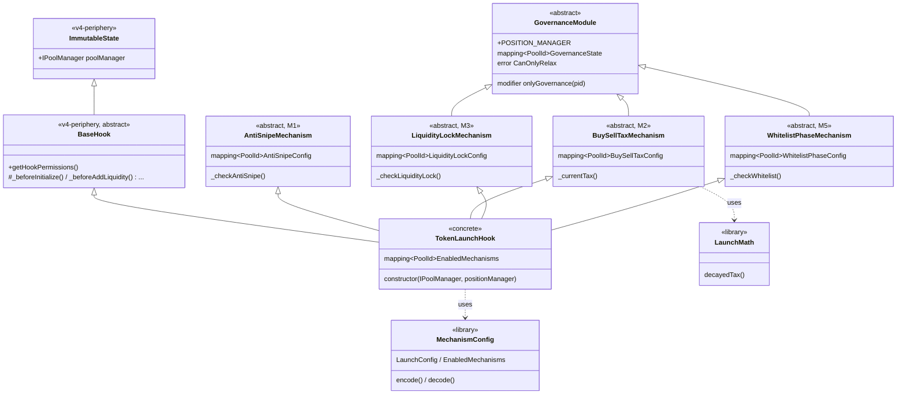

# TokenLaunchHook — диаграмма наследования контрактов

Фактическая иерархия по коду в `src/`. `GovernanceModule` — общий базовый контракт для модулей с
governance-сеттерами (M2/M3/M5); M1 (AntiSnipe) самостоятелен (без governance-сеттеров).
`TokenLaunchHook` собирает все модули и `BaseHook`; `GovernanceModule` попадает в него по «ромбу»
через M2/M3/M5 (Solidity C3-линеаризация включает его один раз, конструктор инициализирует один раз).

**Легенда:**
- `A <|-- B` — B наследует A.
- `A ..> B : uses` — B использует библиотеку A (не наследование).
- `<<v4-periphery>>` — внешние контракты из `lib/v4-hooks-public` (`BaseHook` → `ImmutableState`).

**Не входят в иерархию хука** (отдельные контракты, ещё не реализованы):
`CampaignWrapper` (task_008) — координатор лонча, вызывает `TokenLaunchHook` через PositionManager;
`TokenFactory` + `StandardToken` (task_006) — опциональный клонер ERC-20, независим от хука.
