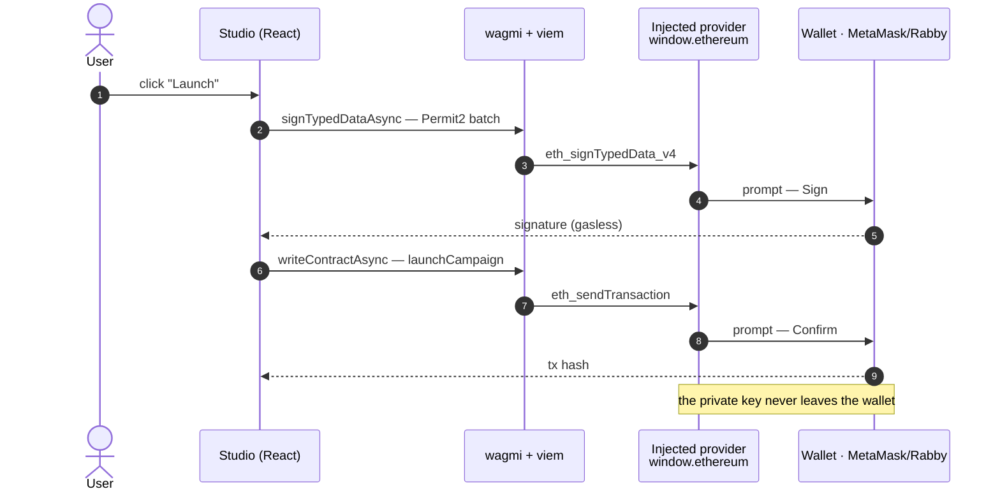
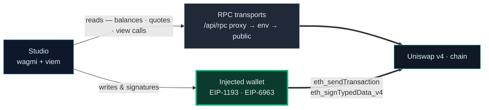

# Frontend — wallet integration

How the Studio dApp (`web/`) connects to wallets and talks to chain. Moved out of the pitch deck to keep
it focused; kept here as reference. Stack: **wagmi v2 + viem**.

## Injected-only wallets

The app connects **only through an injected provider** — the `window.ethereum` object a browser
extension (MetaMask, Rabby) puts on the page, discovered via **EIP-6963** multi-provider announcement.
No WalletConnect, no RainbowKit, so **no `projectId`** is ever required.

- Config: `web/app/providers.tsx` — `createConfig({ connectors: [injected()], ssr: true, ... })`
  (a wagmi `mock` connector is swapped in only when `NEXT_PUBLIC_DEV_BURNER_ADDRESS` is set, for dev).
- Connect UI: `web/components/ui/ConnectButton.tsx` — `useConnect()`, de-duped by wallet name, one
  dropdown listing every discovered injected wallet.
- Gating: `web/components/ConnectGate.tsx` handles not-connected / unsupported-chain / **EOA-only**
  (launches need `tx.origin == msg.sender`, so smart-contract wallets are blocked via `useBytecode`).

An injected provider is just an **EIP-1193** object with a `request({ method, params })` method — it does
*not* have to come from an extension. Our headless self-test (`web/e2e/shim.ts`) injects its own
`window.ethereum` backed by a viem account, so it connects exactly like MetaMask without one.

## Sign + send flow

A launch is two wallet interactions — a gasless Permit2 signature, then the transaction
(`web/lib/campaign/useLaunch.ts`: `useSignTypedData` → `useWriteContract`). The private key never leaves
the wallet; the app only sends EIP-1193 requests.

## Reads via RPC · writes via the wallet

A deliberate split: **reads** (balances, quotes, view calls) go through the app's own RPC transports,
**not** the wallet — a same-origin `/api/rpc` proxy first, then an env RPC, then a public fallback
(`web/lib/config/chains.ts`, `fallback([...])`). That means stable reads, no browser CORS, and a UI that
works even before a wallet is connected. Only **signatures & transactions** go through the injected
wallet.

